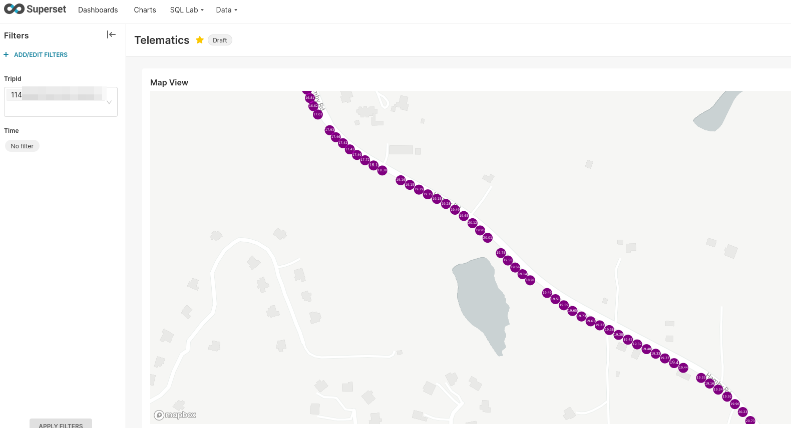
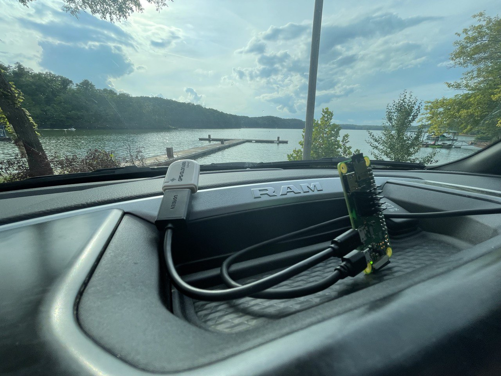

# Tiny Telematics

Track your vehicle's live location offline by using little more than a Raspberry Pi & a gps dongle (aka "[Tiny Telematics](https://chollinger.com/blog/2022/08/tiny-telematics-tracking-my-trucks-location-offline-with-a-raspberry-pi-redis-kafka-and-flink-part-1/)"), without expensive subscription services.

## Introduction

`Tiny Telematics` is an application stack consisting of a `Raspberry Pi` client and a `Apache Flink` based backend that communicate via `Kafka` and cache data via `redis`.

Once running, `Tiny Telematics` can track your vehicle's location with reasonable accuracy, and doesn't require expensive subscription services or in-vehicle WiFi. 



More details can be found in [`architecture.md`](docs/architecture.md).

## Client Setup

The client runs best on a prepared `Raspbian` image. You can find the steps to build this image [here](https://chollinger.com/blog/2022/08/tiny-telematics-tracking-my-trucks-location-offline-with-a-raspberry-pi-redis-kafka-and-flink-part-1/#building-a-small-image). 

This image contains - 

- All `gpsd` dependencies
- `Python 3.8.13` w/ `poetry`
- `redis` w/ a `systemd` service
- `docker`

### Docker

**This does not work on `armv6`!** This is the easiest route to deploy.

Make sure you expose your host network & the appropriate device in `/dev`. 

```bash
# For local development, start a local kafka and redis instance
#docker-compose up -d 
docker run -d --name redis-stack -p 6379:6379 -p 8001:8001 redis/redis-stack:latest
# Build and run
docker build -t tiny-telematics .
docker run -v $(pwd)/config:/config --device=/dev/ttyACM0 --net=host --restart=on-failure:5 tiny-telematics --config /config/default.yaml
```

If you want to build a multi-arch image for a Raspi (`armv7` or `arm64`):

```bash
❯ docker buildx create --name cross
❯ docker buildx use cross
❯ docker buildx build --platform linux/amd64,linux/arm/v7 -t tiny-telematics:latest .
```

## Server Setup

### Flink

See [flink/README.md](flink/README.md)

### MySQL

See [flink/README.md](flink/README.md)

### Kafka

See [docker-compose](https://developer.confluent.io/quickstart/kafka-docker/) 

## Development

Please see [`development_setup.md`](docs/development_setup.md) for details. *tl;dr*: `gpsd`, `poetry`, `python 3.8.13`.

### Run Unit Tests

```bash
poetry shell
poetry run pytest tests -v  
```

### Run

```bash
poetry shell
python3 tiny_telematics/main.py --config config/dev.yaml
# or sbin/run_client.sh - will ask for sudo to setup gpsd
```

## History

I built this over the years in three different iterations - `Hadoop`, `AWS IoT Greengrass`, and what you're looking at now - for my [blog](https://chollinger.com/blog/). The most recent iteration is what I consider stable and usable and what I daily drive in my truck. The older git tags are mostly to accompany the older blog articles.



## License

This project is licensed under the GNU GPLv3 License - see the [LICENSE](LICENSE) file for details.
