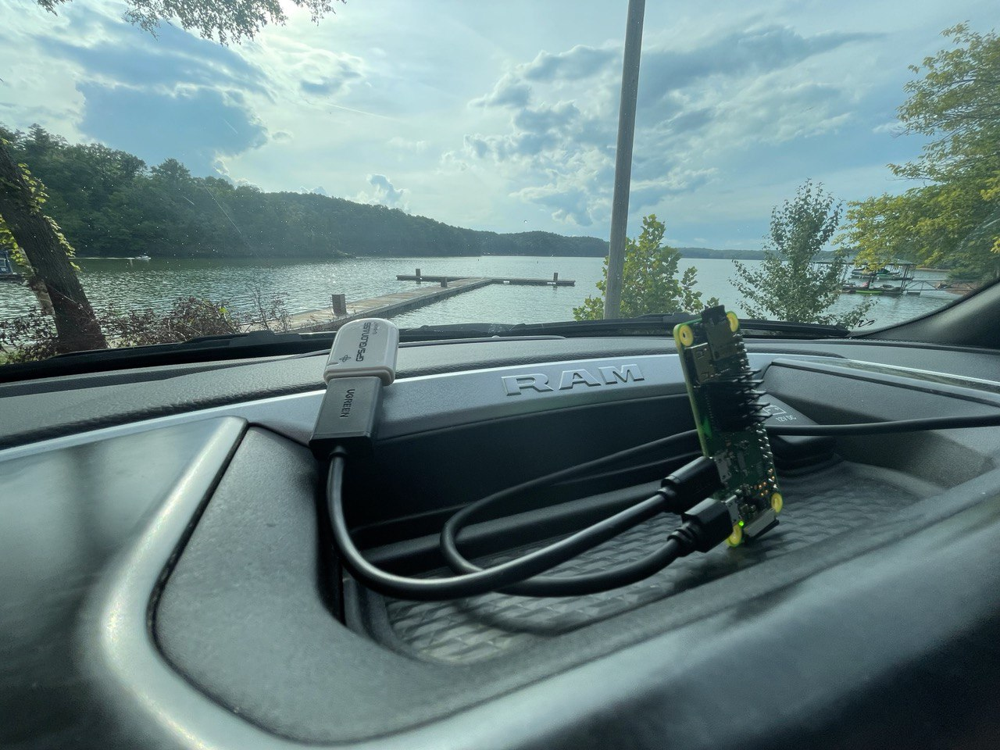
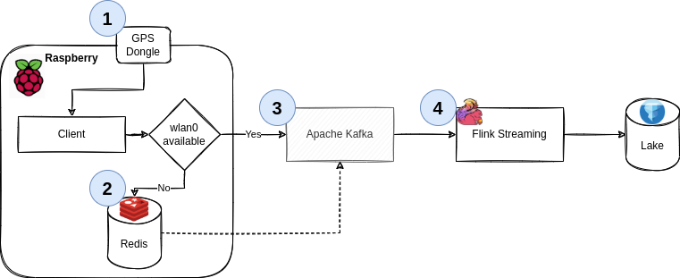

# Tiny Telematics

A (tiny) Telematics solution I built over the years in three different iterations (`Hadoop`, `AWS IoT Greengrass`, and completely locally with `redis`, `Kafka`, and `Flink`), for my [blog](https://chollinger.com/blog/).



## Setup

There's 2 parts: The client app (runs on a Raspberry Pi, steps 1 and 2) and the backend, which is a `Flink` job that reads from `Kafka` and writes to `MariaDB` (steps 3 and 4). See the [blog](https://chollinger.com/blog/2022/08/tiny-telematics-building-the-thing-my-truck-can-do-just-better-using-redis-kafka-and-flink/) for details.



### Docker

Easiest route. Make sure you expose your host network & the appropriate device in `/dev`. **This does not work on `armv6`!**

```bash
# For local development, start a local kafka and redis instance
#docker-compose up -d 
docker run -d --name redis-stack -p 6379:6379 -p 8001:8001 redis/redis-stack:latest
# Build and run
docker build -t tiny-telematics .
docker run -v $(pwd)/config:/config --device=/dev/ttyACM0 --net=host --restart=on-failure:5 tiny-telematics --config /config/default.yaml
```

If you want to build a multi-arch image for a Raspi (`armv7` or `arm64`):

```bash
❯ docker buildx create --name cross
❯ docker buildx use cross
❯ docker buildx build --platform linux/amd64,linux/arm/v7 -t tiny-telematics:latest .
```

### Development / Bare Metal Deploy

If you want to or need to run this on bare metal, you'll need to set up the following for this to work - 

- Client
  - `Python` w/ `poetry`
  - `gpsd`
  - `redis`
- Server
  - MariaDB/mySQL
  - Kafka

#### Client (Raspberry Pi)

```bash
# Install poetry
curl -sSL https://raw.githubusercontent.com/python-poetry/poetry/master/get-poetry.py | python -
# Install an appropriate python version
curl https://pyenv.run | bash
echo 'export PYENV_ROOT="$HOME/.pyenv"' >> ~/.bashrc
echo 'command -v pyenv >/dev/null || export PATH="$PYENV_ROOT/bin:$PATH"' >> ~/.bashrc
echo 'eval "$(pyenv init -)"' >> ~/.bashrc

pyenv install 3.8.13
poetry env use ~/.pyenv/versions/3.8.13/bin/python3
poetry shell
poetry install
```

Get `redis` via a package manger or compile from source.

You can then set up a `systemd` service:

```bash
sudo cp service/tiny-telematics.service /etc/systemd/system
sudo systemctl daemon-reload
sudo systemctl enable tiny-telematics 
sudo service tiny-telematics start
```

#### `gpsd`

Please see [sbin/setup_gps.sh](sbin/setup_gps.sh) for the GPS setup. Mileage will vary depending on your distribution. It's currently pretty bad.

##### Version Trouble

The `gps` package is only compatible with `Python 3.8`, because `3.9` removed the `encoding` keyword in `JSONDecoder`:

```bash
TypeError: JSONDecoder.__init__() got an unexpected keyword argument 'encoding'
```

This is, however, *not* the fault of the maintainers of `gpsd`, see the issue [here](https://gitlab.com/gpsd/gpsd/-/issues/122), since they do not maintain the `pip` project (or any binaries for that matter). If you can, build it from scratch.

##### ipv6 loopback needs to be enabled

Please see https://bugs.debian.org/cgi-bin/bugreport.cgi?bug=818332

```bash
sudo sysctl -w net.ipv6.conf.lo.disable_ipv6=0
```

## Backend

### Flink

See [flink/README.md](flink/README.md)

### MySQL

See [flink/README.md](flink/README.md)

### Kafka

See [docker-compose](https://developer.confluent.io/quickstart/kafka-docker/) 

## Test

```bash
poetry shell
poetry run pytest tests -v  
```

## Run

```bash
poetry shell
python3 tiny_telematics/main.py --config config/dev.yaml
# or sbin/run_client.sh - will ask for sudo to setup gpsd
```

## License

This project is licensed under the GNU GPLv3 License - see the [LICENSE](LICENSE) file for details.
