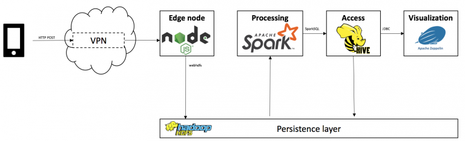
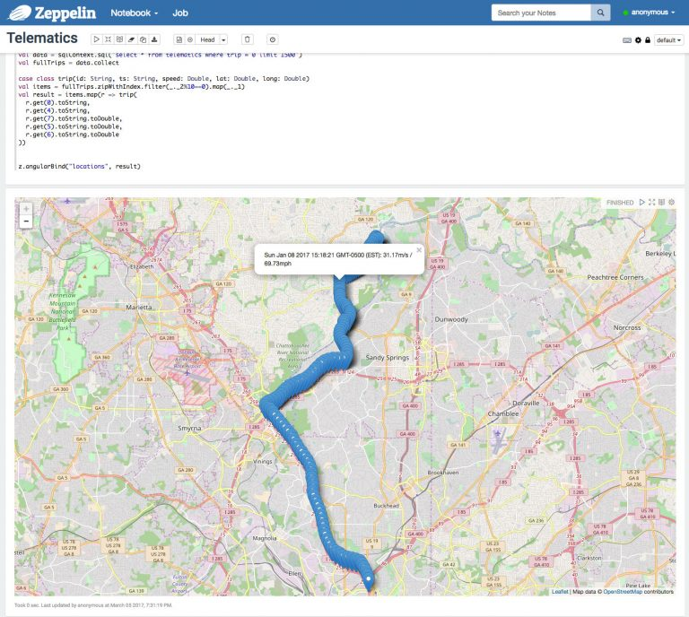
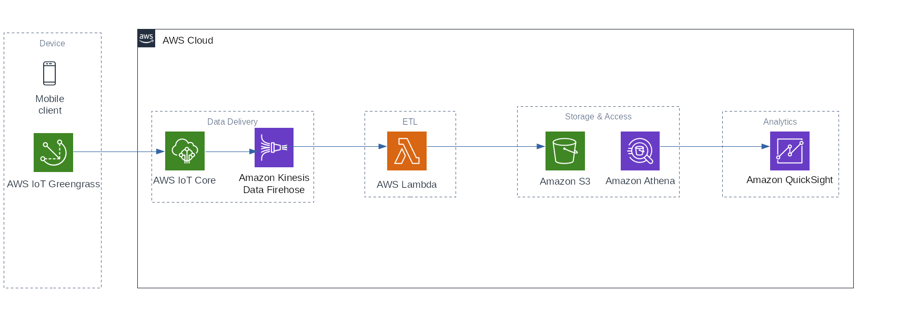
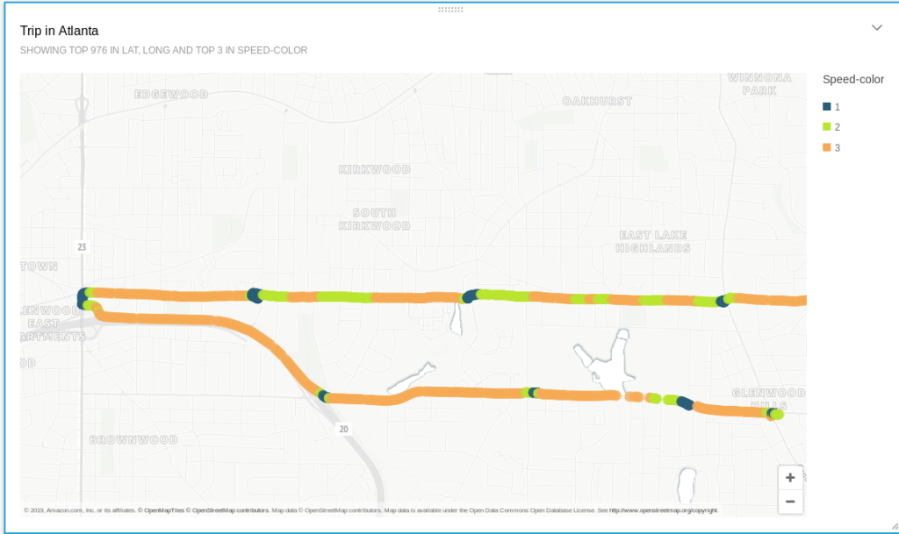

# Tiny Telematics
A telematics showcase for my blog.

The project collects data from a driver and generates reports and dashboards.

The project is split into 2 logical elements: `Hadoop` and `AWS`. The below sections explain the differences.

The `Hadoop` way uses batch processing and relies on [SensorLog](https://apps.apple.com/us/app/sensorlog/id388014573), an iOS app. Other than that, it is entirely based on Open Source.

The `AWS` way is vendor-locked to AWS (to a degree), but processes data in real-time. It relies on a physical GPS dongle.
 
## The Hadoop Way
The original article used Spark, Hive, and Zeppelin to process the data and can be found [here](https://chollinger.com/blog/2017/03/tiny-telematics-with-spark-and-zeppelin/).

The associated branch for hadoop is `hadoop`.

## The AWS Way
The "new" way is using AWS with IoT Greengrass, Kinesis Firehose, Lambda, Athena, and QuickSight and can be found [here](https://chollinger.com/blog/2019/08/how-i-built-a-tiny-real-time-telematics-application-on-aws/).

It depends on a physical GPS dongle, as it uses the `gps` Kernel module.

The associated branch for AWS is `master`.

# AWS Setup
Please see the blog article for AWS details.

For the local setup, a Linux kernel is required.

## Lambda
Please see `lambda/telematics-input/deploy_venv.sh` for the deployment script.

## GPSD
Please see `sbin/setup_gps.sh` for the GPS setup. Mileage will vary depending on your distribution.

## License
This project is licensed under the GNU GPLv3 License - see the [LICENSE](LICENSE) file for details.
